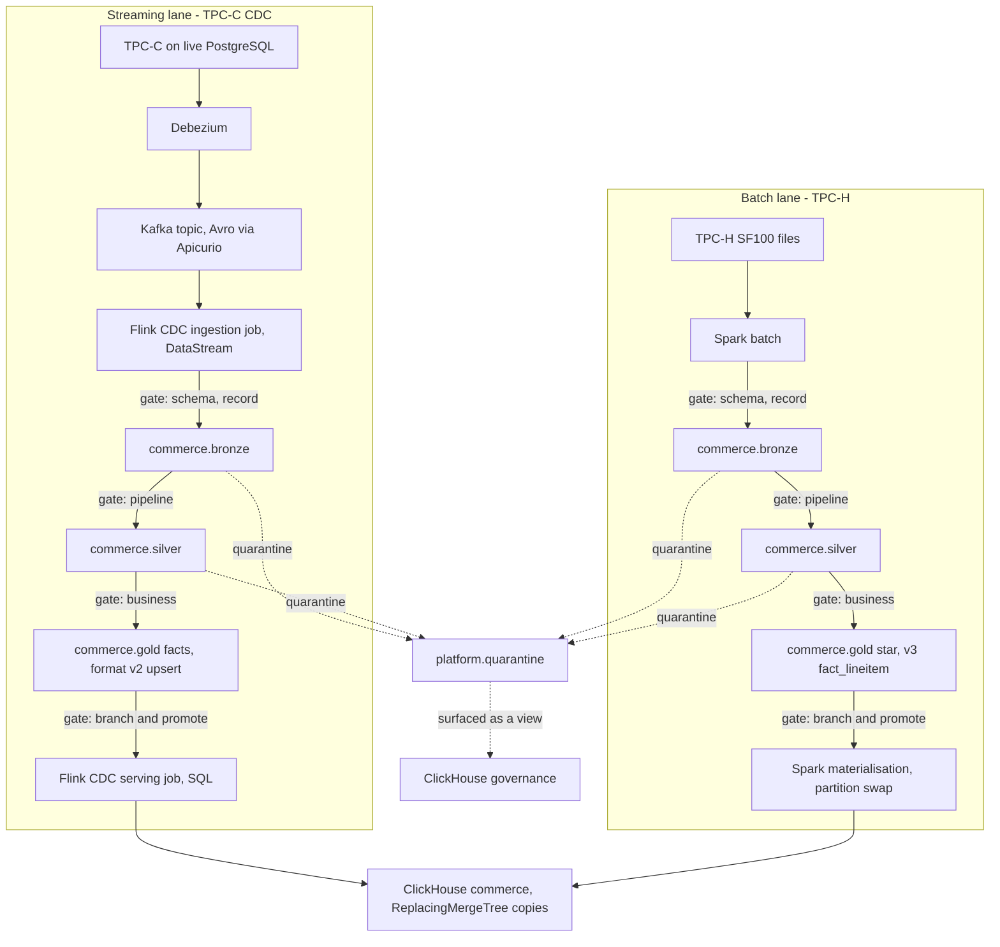
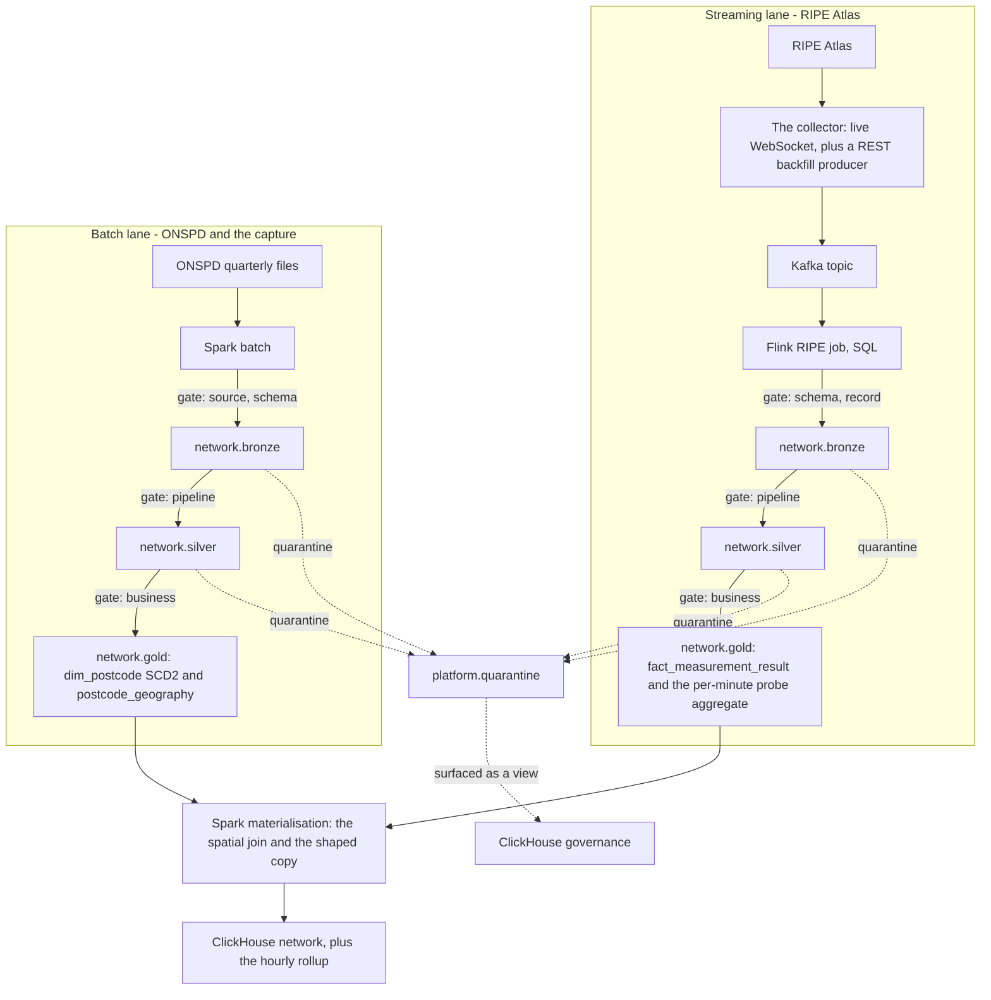
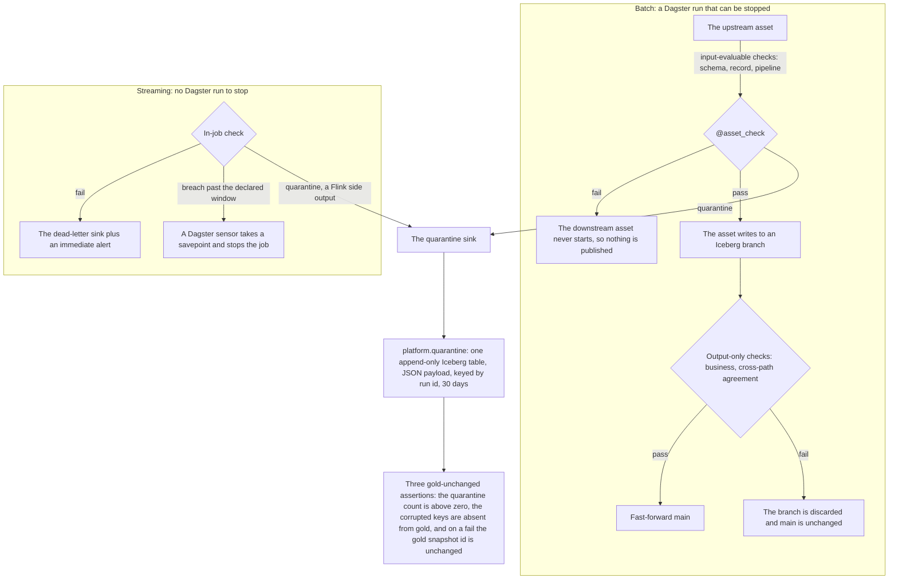

# The data-flow diagrams: source to serving, per spine, with the gate where it sits

**Ticket:** [The architecture synthesis: system architecture, data architecture and data-flow diagrams](https://github.com/SoongGuanLeong/de-platform/issues/26)
**Map:** [Vendor-neutral lakehouse data platform: architecture proposal](https://github.com/SoongGuanLeong/de-platform/issues/9)
**Decisions recorded here:** no new ADR. The flows are the decisions in [ADR-0008](adr/0008-two-spines-with-no-cross-domain-join.md), [ADR-0011](adr/0011-flink-native-iceberg-sink-for-cdc.md), [ADR-0012](adr/0012-flink-writes-the-serving-copy.md), [ADR-0014](adr/0014-ripe-content-hash-and-backfill-producer.md), [ADR-0015](adr/0015-serving-feed-as-its-own-job.md) and [ADR-0016](adr/0016-gate-on-input-and-promote-through-a-branch.md).

---

## 0. Status

No platform code exists while the map is open. These are designs. The tables, layers and gates they draw are the ones [the data architecture](data-architecture.md) states, and the diagram is not a new source of truth for any of them.

## 1. What this document is

The mission's `Research & Architecture Proposal` item 14 ("data-flow diagrams") and the architecture half of its section 22 documentation list. Three diagrams:

- **D1**, the commerce spine, with the CDC streaming lane and the TPC-H batch lane drawn as distinct lanes.
- **D2**, the network spine, with the RIPE streaming lane and the ONSPD batch lane drawn as distinct lanes.
- **G1**, the gate and the quarantine path, drawn **once**, because the mechanism is identical in both spines.

The gate appears on D1 and D2 as an edge annotation naming the check kinds, referencing G1. Drawing the mechanism on both spine diagrams would be two copies of one decision, and the copies would drift.

## 2. How to read them

- A **layer edge** is where a gate sits. Every edge from bronze to silver and silver to gold carries one, and the gold contract check is the one that must never be bypassed.
- A **dotted edge** leaves the data path. Quarantine leaves the path and does not stop it.
- The **two lanes inside a spine** are two different paths over the same layers, not two copies of the same path. One is streaming, one is batch, and they write different tables.
- **The spine boundary is drawn as an absence.** There is no edge between D1 and D2 except the clock, and that absence is the decision.

## 3. D1: the commerce spine

*D1. The CDC lane writes the three ReplacingMergeTree facts, which is the single named streaming exception, and it is the only lane whose serving copy is not written by a partition swap. The batch lane writes the TPC-H star. Both converge on the `commerce` ClickHouse database and on nothing else: there is no join between the two lanes, and no shared key.*

## 4. D2: the network spine

*D2. The streaming lane lands raw results and the probe aggregate; the batch lane builds the geography. They meet at the spatial join, which is the one genuine cross-source join in the platform, and it is approximate with a documented tolerance. The serving copy is a shaped one: the resolved `postcode_area` is baked on at materialisation, and the hourly rollup serves the trend query. The `source` check kind appears here rather than on D1 because ONSPD's defects are the publisher's own, and a publisher defect is a different claim from an injected fault.*

## 5. G1: the gate and the quarantine path

*G1. The gate is a placement, not a component: it is a Dagster `@asset_check`, and the check framework stays a pure function that returns offending rows and a reason while the asset performs the write. The three severities have exactly one action each. `warn` records and continues. `quarantine` diverts the offending rows and continues, and escalates to `fail` only on a declared quarantine budget breach. `fail` publishes nothing and starts nothing downstream. The write-then-mark-failed pattern is never used, which is why an output-only check writes to a branch and promotes it rather than writing gold and reversing it.*

## 6. The seam

D1 and D2 share Kafka, Flink, Iceberg, ClickHouse and the whole control plane, and they share no key. The only cross-spine link is a clock, and it is used for nothing in this platform: there is no cross-spine query, no conformed dimension spanning the two, and no diagram edge between them.

The seam is a decision, not a gap in the drawing ([ADR-0008](adr/0008-two-spines-with-no-cross-domain-join.md)). The honest cross-source relationship is inside D2, between the RIPE results and ONSPD geography, and it is drawn there.

## 7. Named constraints

1. Nothing here is measured.
2. The diagrams show logical flow, not deployment. Which components are co-resident under which profile is in the ceiling register, not here.
3. The gate markers name check kinds; the severities and the escalation rule are G1's.
4. D1 and D2 are drawn as disconnected graphs on purpose, and a future reader who adds an edge between them is reversing ADR-0008 rather than completing the picture.

---

*Resolved by [the architecture-synthesis ticket](https://github.com/SoongGuanLeong/de-platform/issues/26) on [the map](https://github.com/SoongGuanLeong/de-platform/issues/9). Inputs: [dataset-selection](dataset-selection.md), [serving-layer](serving-layer.md), [streaming-jobs](streaming-jobs.md), [governance-and-data-quality](governance-and-data-quality.md), and [the system architecture](system-architecture.md) and [the data architecture](data-architecture.md) written beside this document.*
