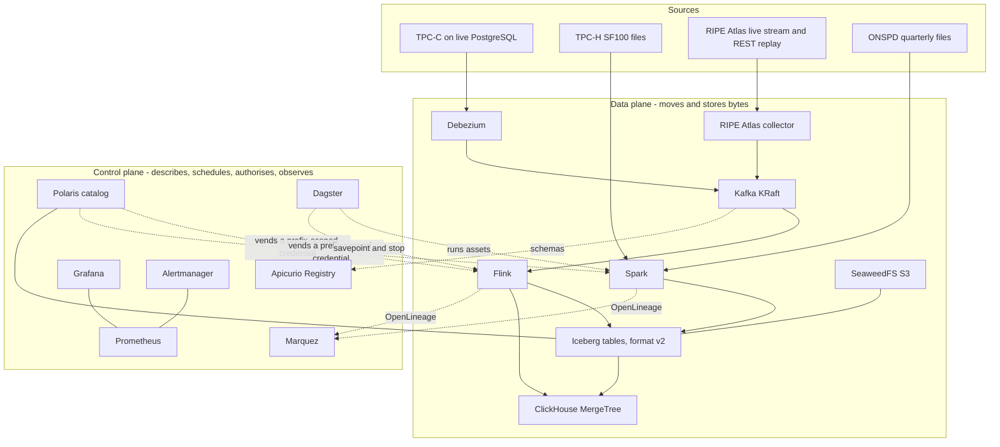

# The system architecture: components, planes, boundaries and the ADR map

**Ticket:** [The architecture synthesis: system architecture, data architecture and data-flow diagrams](https://github.com/SoongGuanLeong/de-platform/issues/26)
**Map:** [Vendor-neutral lakehouse data platform: architecture proposal](https://github.com/SoongGuanLeong/de-platform/issues/9)
**Target posting:** ONL Biz Solutions, Senior Data Engineer - Data Lakehouse ([JobStreet 94703893](https://my.jobstreet.com/job/94703893)), cached verbatim at `~/projects/career-ops/data/jd-cache/031.md`.
**Decisions recorded here:** no new ADR. This document is a synthesis of decisions already recorded in ADR-0001 to ADR-0034 and in the per-domain specs it cites.

---

## 0. Status

No platform code exists while the map is open. **Nothing in this document was measured.** Every figure is a declared budget or an arithmetic result over documented defaults. Where this document states a value that another document owns, that document is the authority and the value is restated for the reviewer's convenience, with [a structural check](ci-cd-strategy.md) asserting the two agree.

## 1. What this document is

The mission's Final Deliverables item 4 ("system architecture") and the `Research & Architecture Proposal` item 7 ("proposed end-to-end architecture"). It consolidates what the per-domain specs decided separately into one view a senior reviewer can read in a sitting: the component set, the two planes, the boundaries, the diagram, and the mapping from every ADR to the element it attaches to.

It does not restate the reasoning behind a component's selection ([the technology selection](technology-selection.md) owns that), the per-table layout ([the data architecture](data-architecture.md) consolidates it), or the deployment shape ([the local development architecture](local-development.md) and [the cloud architecture](cloud-architecture.md) own that).

## 2. The component set, and why it is twenty

The component list is [the technology selection](technology-selection.md)'s. This document adds only the structure the selection matrix does not carry: which plane each component sits in, and which components are services at all.

| Kind | Count | Members |
|---|---|---|
| Data-plane services | 8 | RIPE Atlas collector, Debezium, Kafka, Flink, Spark, SeaweedFS, ClickHouse, PostgreSQL |
| Control-plane services | 7 | Polaris, Dagster, Apicurio, Marquez, Prometheus, Grafana, Alertmanager |
| Libraries and CLIs | 4 | Iceberg (library), OpenLineage (specification and client), Helm (CLI), OpenTofu (CLI) |
| Container runtime | 1 | Podman |
| **Total** | **20** | |

**The counting rule, recorded so the number can be checked.** A component is **a service the platform runs, resident or transient**. Spark is the precedent for a transient component: it is a service, it is counted, and it is a transient member of the `batch` profile. A library, a CLI, a framework or a bespoke job is not a component. This is the rule that admits the collector (a long-lived service with its own lifecycle) and keeps out Dagster's user-code deployment, the data-quality framework, the contract validator and the batch job code.

**The collector is the twentieth, and it is a correction rather than an addition.** [The incident laboratory](incident-laboratory.md) names it as an actor in two of its six scenarios, and [the repository decomposition](repository-decomposition.md) puts it in `ingestion/network/`. It was always in the platform; it was missing from the count. It is recorded as the fifth requirement-driven addition, because the network spine's streaming source demands an ingestion service and the posting names no such tool. It is deliberately **not** infrastructure: [the glossary](../CONTEXT.md) defines infrastructure as what exists only because the cloud needs it, and the collector runs locally.

**It is also load-bearing for the evidence.** Incidents 1 and 6 run under the `streaming` profile with the collector among their components, and incident 1 is the live-stack injection M16 requires. Before this correction the `streaming` profile could not evidence them, because the collector was not in its service set.

## 3. The two planes

**Data plane:** the components and paths that move or store data. The collector, Debezium, Kafka, Flink, Spark, SeaweedFS and the Iceberg bytes it holds, ClickHouse, and PostgreSQL in its role as the CDC source.

**Control plane:** the components that describe, schedule, authorise or observe data. Polaris, Dagster, Apicurio, Marquez, Prometheus, Grafana and Alertmanager.

**A component has a primary plane, and a crossing edge is drawn rather than resolved away.** Two crossings matter:

- **Polaris vends a prefix-scoped credential into the data plane.** Flink and Spark write Iceberg bytes directly to SeaweedFS using a credential Polaris issued, so the write path does not pass through the catalog. That is why the authorisation seam exists and why a read of a table's bytes is attributable to no system ([ADR-0004](adr/0004-authorisation-seam-between-catalog-and-engine.md), [ADR-0030](adr/0030-audit-what-exists-and-name-what-cannot-be-attributed.md)).
- **Dagster starts work in the data plane.** It runs Spark assets and it takes savepoints and stops Flink jobs, but it does not own the running Flink runtime ([ADR-0015](adr/0015-serving-feed-as-its-own-job.md)).

**Disambiguation, because "plane" is an overloaded word here.** This is the component-level cut, and it is not the same axis as the glossary's **Metadata plane**, which describes what a catalog authorises as against a read that fetches bytes directly. It is also not the **EKS control plane**, which is the provider's term for a part of the managed Kubernetes service. The security model's use of "control plane" for the surfaces left unauthenticated is renamed **the unauthenticated surfaces register**, which is what that document already calls its section 5, for the same reason.

## 4. The boundaries

Four boundaries carry a claim. The rest are ordinary process boundaries: every component is its own container locally and its own workload in the cloud.

| Boundary | What it separates | What enforces it |
|---|---|---|
| **The spine boundary** | The commerce spine from the network spine | Nothing joins them; the only link is a clock ([ADR-0008](adr/0008-two-spines-with-no-cross-domain-join.md)) |
| **The catalog boundary** | Every engine from Polaris's proprietary API | The engines reach Polaris only through the Iceberg REST specification, which is what makes the catalog a swappable URI ([ADR-0010](adr/0010-polaris-behind-the-rest-spec.md)) |
| **The serving boundary** | Analysts from Iceberg | ClickHouse holds materialised MergeTree copies; catalog read-through is read-only and exists only as the measured comparison arm ([ADR-0003](adr/0003-materialised-serving-store-not-read-through.md)) |
| **The authorisation seam** | The catalog's control from the engine's control | Two independent systems with a written seam, because neither covers both paths ([ADR-0004](adr/0004-authorisation-seam-between-catalog-and-engine.md)) |

The engineering-path boundaries are the repository decomposition's, and they are structural rather than conventional: commerce and network may not import each other, no path imports another path, and `platform/` is a leaf ([ADR-0026](adr/0026-one-repository-path-first.md)).

## 5. S1: the system architecture

Two spines, two planes, and the crossings between them. The seam between the spines is drawn as an absence: there is no edge between the commerce lane and the network lane, and that is the decision, not an omission.

*S1. Prometheus scrapes every service in both planes and Grafana and Alertmanager read from Prometheus; those edges are omitted so the diagram stays readable. The commerce spine is TPC-C through Debezium and TPC-H through Spark. The network spine is RIPE Atlas through the collector and ONSPD through Spark. The two lanes share Kafka, Flink, Iceberg, ClickHouse and the control plane, and share no key. Dotted edges are control-plane crossings, not data flows. Deployment form is not shown; the local and cloud shapes are in [the local development architecture](local-development.md) and [the cloud architecture](cloud-architecture.md).*

## 6. Where each ADR lands

Every ADR, against the element it attaches to. The split matters for a reviewer reading S1: the first group is visible on the diagram, the second is not, and saying so prevents a reader looking for a decision that was never architectural.

### Attached to the running system

| ADR | Decision | Element |
|---|---|---|
| [0001](adr/0001-convergence-not-ordering.md) | Claim convergence, not ordering, for the change-capture path | CDC ingestion path |
| [0002](adr/0002-exactly-once-effect-not-delivery.md) | Claim exactly-once effect on committed state, not exactly-once delivery | Streaming to Iceberg sink |
| [0003](adr/0003-materialised-serving-store-not-read-through.md) | Materialise the serving layer into MergeTree rather than reading Iceberg in place | ClickHouse |
| [0004](adr/0004-authorisation-seam-between-catalog-and-engine.md) | Enforce access control in two systems and document the seam | Polaris and ClickHouse, the authorisation seam |
| [0005](adr/0005-use-opentofu-instead-of-terraform.md) | Use OpenTofu instead of Terraform | OpenTofu, deployment |
| [0008](adr/0008-two-spines-with-no-cross-domain-join.md) | Carry two independent data spines, and join nothing across them | The spine boundary |
| [0009](adr/0009-dataset-licence-position-and-obligations.md) | Record the dataset licence position and the obligations it creates | The sources |
| [0010](adr/0010-polaris-behind-the-rest-spec.md) | Reach Polaris only through the Iceberg REST spec, Lakekeeper as fallback | Polaris, the catalog boundary |
| [0011](adr/0011-flink-native-iceberg-sink-for-cdc.md) | Write CDC into Iceberg with Flink's native sink, not Kafka Connect | Flink to Iceberg |
| [0012](adr/0012-flink-writes-the-serving-copy.md) | Write the streaming serving copy from Flink, converge with ReplacingMergeTree | Flink to ClickHouse |
| [0013](adr/0013-lsn-ordering-in-a-stateful-operator.md) | Enforce LSN order in a stateful operator, not by keying alone | The CDC ingestion job |
| [0014](adr/0014-ripe-content-hash-and-backfill-producer.md) | Key the RIPE Atlas stream by a content hash, REST replay as backfill producer | The collector, the RIPE ingestion job |
| [0015](adr/0015-serving-feed-as-its-own-job.md) | Run the ClickHouse serving feed as its own job | The CDC serving job |
| [0016](adr/0016-gate-on-input-and-promote-through-a-branch.md) | Gate on the input, promote output through an Iceberg branch | The gate, Iceberg branches |
| [0017](adr/0017-minimise-pii-rather-than-mask-it.md) | Minimise PII rather than mask it | The gold layer, ClickHouse grants |
| [0018](adr/0018-time-bounded-kafka-retention-for-cdc.md) | Time-bounded Kafka retention for CDC, not compaction | Kafka |
| [0019](adr/0019-contracts-are-contract-first-and-break-by-version.md) | Contracts are contract-first and break by version | The contract layer |
| [0020](adr/0020-avro-on-the-cdc-topics-with-backward-transitive-compatibility.md) | Avro on the CDC topics with BACKWARD_TRANSITIVE compatibility | Apicurio, the CDC topics |
| [0021](adr/0021-the-consumer-interface-is-the-versioned-serving-views.md) | The consumer interface is the versioned serving views | ClickHouse views |
| [0023](adr/0023-rollback-restores-the-iceberg-table-only.md) | Rollback restores the Iceberg table only | Iceberg snapshots |
| [0024](adr/0024-engine-pins-follow-the-iceberg-connector-matrix.md) | Engine pins follow Iceberg's supported connector matrix | Iceberg, Flink, Spark |
| [0025](adr/0025-iceberg-v3-copy-on-write-for-schema-evolution.md) | Iceberg v3 for the schema-evolution demonstration only, superseding 0022 | Iceberg format, ClickHouse read path |
| [0027](adr/0027-self-host-what-the-platform-operates.md) | Self-host what the platform operates, buy only the primitives | The cloud topology |
| [0028](adr/0028-secrets-live-only-in-the-runtime-directory.md) | Keep every secret value out of tracked files, control the write path | Secrets, every component |
| [0029](adr/0029-authenticate-the-data-plane-and-register-the-open-control-plane.md) | Authenticate the data plane, encrypt where a refusal can be shown, register the open surfaces | The data plane, the open surface register |
| [0030](adr/0030-audit-what-exists-and-name-what-cannot-be-attributed.md) | Audit what exists, name the attribution mechanism, record what cannot be attributed | The audit posture |
| [0031](adr/0031-the-local-execution-model-is-profile-scoped-and-host-anchored.md) | Scope the local execution model per profile, anchored to the host | The profiles |
| [0034](adr/0034-the-one-built-image-is-published-to-ghcr.md) | The one self-built image goes to GitHub Container Registry | Marquez's arm64 image |

### Process and documentation, not the running system

| ADR | Decision | Element |
|---|---|---|
| [0006](adr/0006-reference-only-reuse-and-provenance.md) | Treat the prior repository as reference-only | Repository provenance |
| [0007](adr/0007-completion-bar-as-a-gate.md) | Make the completion bar a validated gate | The completion register, CI |
| [0022](adr/0022-iceberg-format-v2-is-pinned.md) | Iceberg format v2 is pinned | Superseded by ADR-0025 |
| [0026](adr/0026-one-repository-path-first.md) | One repository, split by engineering path | Repository structure |
| [0032](adr/0032-the-level-determines-the-strongest-claim-a-test-may-support.md) | The level determines the strongest claim a test may support | The evidence standard |
| [0033](adr/0033-delivery-is-validated-artefacts-not-a-gitops-controller.md) | Delivery is validated artefacts and a runbook | Delivery |

ADR-0022 is listed in the second group because it is superseded and has no live element; its replacement ADR-0025 carries the decision.

## 7. How this differs from the mission's starting hypothesis

The mission's section 28 diagram is prefaced as a hypothesis and explicitly open to modification. Four of its elements were replaced, one was added, and the rest survived. Recording the delta is cheaper than making a reviewer diff the two pictures.

| Mission hypothesis | What this platform does | Why |
|---|---|---|
| Trino beside ClickHouse | **No Trino and no federated query engine** | The posting names only ClickHouse, and an unexercised Trino proves nothing. Out of scope on the map |
| Superset or SQL as the consumer surface | **No BI tool** | Not in the posting; surface area without engineering depth |
| Terraform | **OpenTofu** | Terraform relicensed to BUSL and fails the longevity rubric ([ADR-0005](adr/0005-use-opentofu-instead-of-terraform.md)) |
| MinIO as the object store | **SeaweedFS** | MinIO was archived on 25 April 2026 and fails the rubric's hard floor |
| Iceberg read in place by the query engine | **Materialised MergeTree copies**, with read-through retained as the measured comparison arm | Catalog read-through gets none of MergeTree ([ADR-0003](adr/0003-materialised-serving-store-not-read-through.md)) |
| "Data Quality" as a box | **A Dagster `@asset_check` gate with severity**, plus quarantine and a dead-letter path | A check that stops nothing is not a gate ([ADR-0016](adr/0016-gate-on-input-and-promote-through-a-branch.md)) |
| (absent) | **The RIPE Atlas collector** | The network spine's streaming source needs an ingestion service; the posting names none |
| Kafka, Flink, Spark, Iceberg, Polaris, Dagster, Prometheus, Grafana, Alertmanager, Helm, AWS, EKS, S3, RDS, VPC | Kept as named | They are the posting's stack |

## 8. Named constraints

1. Nothing here is measured.
2. The seam between the spines is real and is drawn as an absence on S1, D1 and D2 ([ADR-0008](adr/0008-two-spines-with-no-cross-domain-join.md)).
3. `S1` shows logical structure, not deployment. It does not show which components are co-resident under which profile, because they never all are.
4. The count is twenty and the rule that produces it is stated in section 2, so the number is checkable rather than asserted.

## 9. Open measurements and gaps

- **The collector's footprint.** Its 192 MiB ceiling is an initial declared budget with no documented default, because the service is platform-authored. The trigger for revisiting it is the first measured capture, under the `streaming` profile, where its peak RSS is recorded.
- **The collector's error-rate threshold.** Incident 6's detection link names a collector error rate, and no budget id exists for it. Registered as a gap in [the incident laboratory](incident-laboratory.md) rather than invented here.
- **Which components can actually be co-resident** is fixed by the ceiling register, not by this document.

---

*Resolved by [the architecture-synthesis ticket](https://github.com/SoongGuanLeong/de-platform/issues/26) on [the map](https://github.com/SoongGuanLeong/de-platform/issues/9). Inputs: every per-domain spec in `docs/`, `docs/adr/` 0001 to 0034, `docs/requirements-matrix.md`, `docs/mission/MISSION.md` section 22 and section 28, and [the data architecture](data-architecture.md) and [the data-flow diagrams](data-flow.md) written beside this document.*
